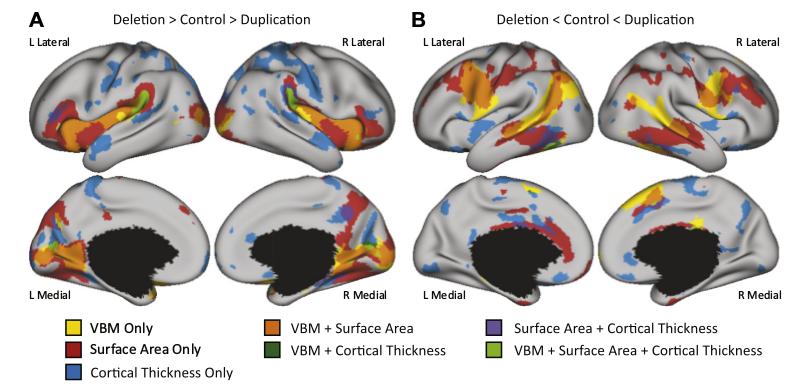
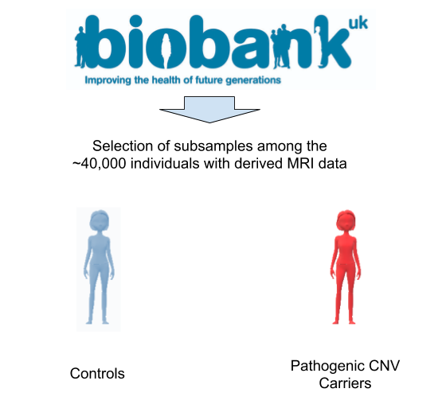

# BLUP: Brain Learning Unicorn Project

Can a model predict if an individual is carrier of a pathogenic genetic variant based on Brain imagery derived data?

*Trying to deal with new stuff learned at the amazing Brainhack school*

  

 

Project contributors: BHS, Elise Alix Douard & anyone interested (with access rigths to UKBiobank?)

## Quick presentation

Welcome to this draft dear unicorn student ! 

  

  Source: https://media.giphy.com/
 

I am Elise, Ph.D. student since near to 4 years, and working on **the contribution of genetic to neurodevelopmental disorders** as autism. 

[/!\ unwanted article advertisment /!\ ](https://www.biorxiv.org/content/10.1101/2020.03.09.979815v1.full)

I don't really fit in a specific domain (genetic/cognitive neurosciences/psychology/neurosciences). I guess it is what we call a unicorn student?

I currently work with genetic data (Copy Number Variants), clinical phenotypes and doing a lot of statistics and graphs. But my initial formation was in cogitive neurosciences where I started to work with multimodal data (combination of Arterial Spin Labelling MRI data and Eye-tracking data).  

Since I started my Ph.D., I never used MRI data anymore, and I am here to take a revange on that. 

I am also an Open Sciences enthusiast!

**Skills:**
- Data management (feed me with multimodal data plz)
- Satistics
- Debugging codes

**Here to learn:**
- Universal languages and tools to share science 
- Machine/Deep learning (more complex stats!)
- Python libraries to change from the R routine

# Project draft: Brain Learning Unicorn Project

## Summary

Can a model predict if an individual is carrier of a pathogenic genetic variant based on Brain imagery derived data?
 

This project aims to feed a **learning** model with **brains** to predict if an individual is carrier of a pathogenic **genetic** variant (meaning that the DNA alteration is deleterious and formally associated to neurodevelopmental disorders and other psychiatric disorders).

The hypothesis is not based on strong assumptions (even if there is multiple publication showing brain alterations associates to pathogenic CNVs), the focus will be on learning how to apply machine learning model for **multimodal dataset**(derived anatomical MRI data, genetic, other clinical data).

## Background
#### What is a pathogenic genetic Copy Number Variants (CNV)?

  

 
Source: Chapter in press

#### Is there specific brain pattern associated to these CNVs?

[Sandra Brevet et al (2018)](http://www.sciencedirect.com/science/article/pii/S000632231831401X) *Big up Sandra!*: 

"*Quantifying the Effects of 16p11.2 Copy
Number Variants on Brain Structure:
A Multisite Genetic-First Study*"

  

 Source: Sandra Martin-Brevet http://www.sciencedirect.com/science/article/pii/S000632231831401X

[Clara Moreau et al (2019)](https://www.biorxiv.org/content/10.1101/862615v1.full) *Big up Clara!*: 

"*Neuropsychiatric mutations delineate functional brain connectivity dimensions contributing to autism and schizophrenia*"

  

Source: Clara Moreau https://www.biorxiv.org/content/10.1101/862615v1.full

### Problematic: 
(Not clear problematic in mind but here is what I want to work on the most)
1) Avoiding the transformation of the data 
2) Deal with missing values 

### Aims: 
Compare the model performances when infering the genetic profil of an individual.

## Tools 
- Python to use nilearn and sklearn libraries
- Jupyter notebook to keep track of the project
- Compute Quebec to run the analyses on the complete sample (<3,000?)
- Git/Github to share the scripts and results 

## Data
A first thought is to use data from [UK Biobank](https://www.ukbiobank.ac.uk/):
- From the genetic side: [Kendall et al.](https://www.cambridge.org/core/journals/the-british-journal-of-psychiatry/article/cognitive-performance-and-functional-outcomes-of-carriers-of-pathogenic-copy-number-variants-analysis-of-the-uk-biobank/0D144F6880A46DC94EE27ADEACB5942B) already published a paper on 33 pathogenic CNV using 420,247 individuals (2019).
For the moment, we have a list of 1,265 individuals with pottentially pathogenic CNVs.
- From the MRI side: All derived anatomical OR fMRI data are available for 40,000 individuals.
- From the phenotypic side: sex, age, ... all the interesting data pertinent for the project which are avalable for most individuals from this cohort.

The final dataset will be a smaller sample of individuals carriers of the most pathogenic CNVs (among the 1,265 selected by [Kendall et al. (2019)](https://www.cambridge.org/core/journals/the-british-journal-of-psychiatry/article/cognitive-performance-and-functional-outcomes-of-carriers-of-pathogenic-copy-number-variants-analysis-of-the-uk-biobank/0D144F6880A46DC94EE27ADEACB5942B)) vs. controls.
These individuals will be selected among the 40,000 with derived MRI data.

  

/!\ The most pathogenic CNVs are really rare, the sample may be much smaller.

## Deliverables
In this GitHub repository:
- README file
- A detailed documentation explaining how the data were acquired, processed, analysed and describing the model used.
- Jupyter notebook detailing the data (selection, distribution,...), the implementation of machine learning algorithms, and the results
- All related scipts
- Slides (using Rise) presenting the project

